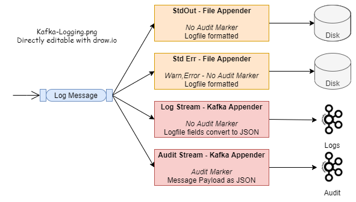

# Spring Boot: how to log to Kafka

Kafka is ideal for log aggregation, particularly for applications that use microservices and are distributed across multiple hosts.

This is an example Spring Boot application that uses [Log4j2's Kafka appender](https://logging.apache.org/log4j/2.x/manual/appenders.html#KafkaAppender) to send JSON formatted log messages to a Kafka topic.

There is now a _Logging_ path and an _Audit_ path.  The path is determined by the presense of an SLF4J "Audit" Marker.



This application runs for 10 seconds.  
* LogMessageGenerator sends some log messages to a _log_ Kafka topic that's defined in `src/main/resources/log4j2.xml`. Here's an example log message:
```
    {
      "timeMillis" : 1485736021946,
      "thread" : "pool-2-thread-1",
      "level" : "INFO",
      "loggerName" : "io.woolford.LogMessageGenerator",
      "message" : "Log message generated %n",
      "endOfBatch" : false,
      "loggerFqcn" : "org.apache.logging.slf4j.Log4jLogger",
      "threadId" : 17,
      "threadPriority" : 5
    }
```
* AuditMessageGenerator sends audit messages to an _audit_ Kafka topic that is defined in `src/main/resources/log4j2.xml`. Here's an example log messages
```
    {
      "message" : "Audit Message Generated",
      "eventIndex": 1
      "eventTimestamp": 1485736021946,
    }
```
Here's a two-minute video that walks through the code:

[](https://www.youtube.com/watch?v=G7wMwEDkX_4)

And a couple 10 minute videos:

[](https://youtu.be/xbbLvpvqTrY)
[](https://youtu.be/nNjSJaun1cE)


## Docker
You can bring up a local Kafka cluster in Docker using the docker-compose.yml file in _local_
```
  docker-compose up
```
and 
```
  docker-compose down --remove-orphans
```

## To do
1) Inject spring properties for the kafka host names and kafka topic names
1) include the host name in  the log message.  Cannot be done in the pattern
1) Understand what behavior should be if Appender cannot reach the broker

## Audit code
Audit code is isolated in the audit package because it was elaborated on more than was probably needed
## Questions
Is the Kafka Appender production hardened for the various broker-down scenarios?
